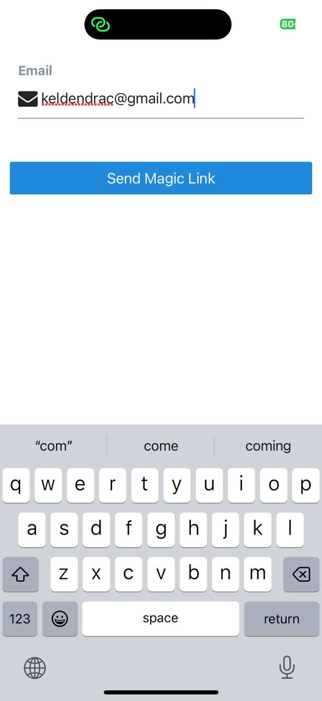

### Practical Report: Implementing Authentication with Supabase

#### 1. What I Have Done
I worked on a React Native app’s authentication system using Supabase, tweaking my professor’s existing code. My tasks included:

- **Email and Password Authentication**: Modified the sign-up and login flows using Supabase’s `auth.signUp` and `auth.signInWithPassword` methods to improve form validation and session handling.

- **Magic Link Authentication**: Adjusted the passwordless login system with `auth.signInWithOtp` to enhance the email link experience.

- **Phone Authentication**: Tweaked the phone-based OTP system using `auth.signInWithOtp` and `auth.verifyOtp`, integrating minor changes for SMS delivery via Twilio.

I retrieved the project URL and API keys from Supabase’s dashboard (https://supabase.com/dashboard/project/unzfzmqzfsqdbdzhwuzi/settings/api) to connect the app to Supabase services.

#### 2. What I Have Learnt
- **Supabase Basics**: Got familiar with Supabase’s auth API and how email, magic link, and phone OTP methods work.
- **Session Management**: Learned how to use AsyncStorage and Supabase’s session tools to keep users logged in.
- **Error Handling**: Improved my skills in catching and displaying auth errors clearly for users.
- **Mobile Auth Challenges**: Understood the need for proper deep linking in mobile apps, especially for magic links.
- **Form Validation**: Picked up tips on validating inputs like phone numbers for E.164 format.

#### 3. What Challenges I Faced
- **App State Issues**: Struggled with keeping the auth state stable when the app was reopened.
- **Phone Number Formatting**: Users had trouble entering phone numbers correctly, causing auth failures.
- **Async Bugs**: Ran into UI glitches where loading states or errors showed up out of sync.
- **Magic Link Navigation**: Had issues getting email links to open the app properly.
- **OTP Delays**: Some users got expired OTP codes due to slow SMS delivery.

#### 4. How Did I Overcome
- **State Fixes**: Added listeners to refresh sessions when the app comes back to the foreground.
- **Better Inputs**: Included clearer instructions for phone number formatting.
- **UI Tweaks**: Cleaned up async flows to fix loading and error display issues.
- **Deep Linking**: Adjusted link configs to make magic links work smoothly.
- **OTP Handling**: Added options to resend OTPs and better timeout messages.

