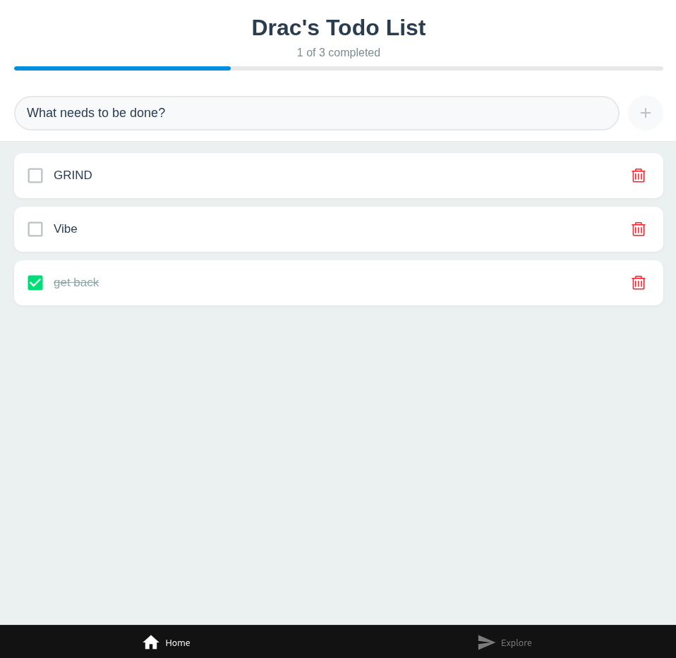
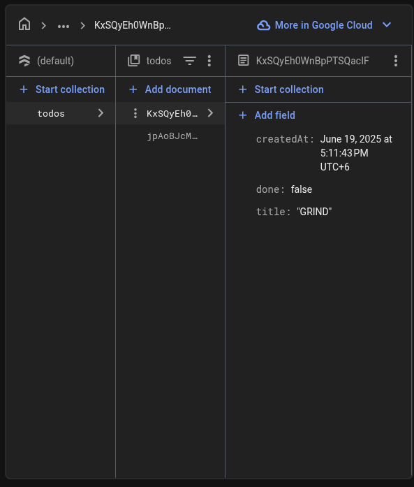

# 📝 Drac's Todo App

A clean, mobile-friendly Todo List app built with **React Native** and **Firebase Firestore**, featuring real-time updates, task management, and a responsive user interface.

---

## 🚀 Features

* ✅ Add, complete, and delete tasks
* 🔁 Real-time sync using Firebase Firestore
* 📊 Live progress tracker with percentage bar
* 🎨 Modern and responsive UI
* ⚡ Offline-first support (Firestore cache)

---

## 📷 Screenshots


---

## 🛠️ Tech Stack

* **React Native**
* **Firebase Firestore**
* **Expo**
* **TypeScript**
* **Icons**: `@expo/vector-icons` (MaterialIcons, AntDesign)

---

## 🔧 Setup Instructions

1. **Clone the repository:**

```bash
gitclone https://github.com/KeldenPDorji/SS2025_SWE201_02230285__.git
```

2. **Install dependencies:**

```bash
npm install
# or
yarn
```

3. **Configure Firebase:**

* Create a Firebase project at [https://console.firebase.google.com](https://console.firebase.google.com)
* Enable **Firestore**
* Replace the content in `firebaseConfig.ts`:

```ts
// firebaseConfig.ts
import { initializeApp } from 'firebase/app';
import { getFirestore } from 'firebase/firestore';

const firebaseConfig = {
  apiKey: 'YOUR_API_KEY',
  authDomain: 'YOUR_AUTH_DOMAIN',
  projectId: 'YOUR_PROJECT_ID',
  storageBucket: 'YOUR_BUCKET',
  messagingSenderId: 'YOUR_MSG_ID',
  appId: 'YOUR_APP_ID',
};

const app = initializeApp(firebaseConfig);
export const FIRESTORE_DB = getFirestore(app);
```

4. **Run the app:**

```bash
npm start
```

> Open with Expo Go on your device or an emulator.

---

## 📌 Notes

* Tasks are stored under the `todos` collection in Firestore.
* The app uses `title` and `done` fields for task data.

---

## ✨ Future Improvements (Optional)

* 🔐 Add Firebase Authentication
* 🗂️ Filter: All / Active / Completed
* ⏰ Add task due dates and reminders
* 📝 Edit task titles

---

## 👨‍💻 Author

**Drac** – *Student project for Practical 3*

---